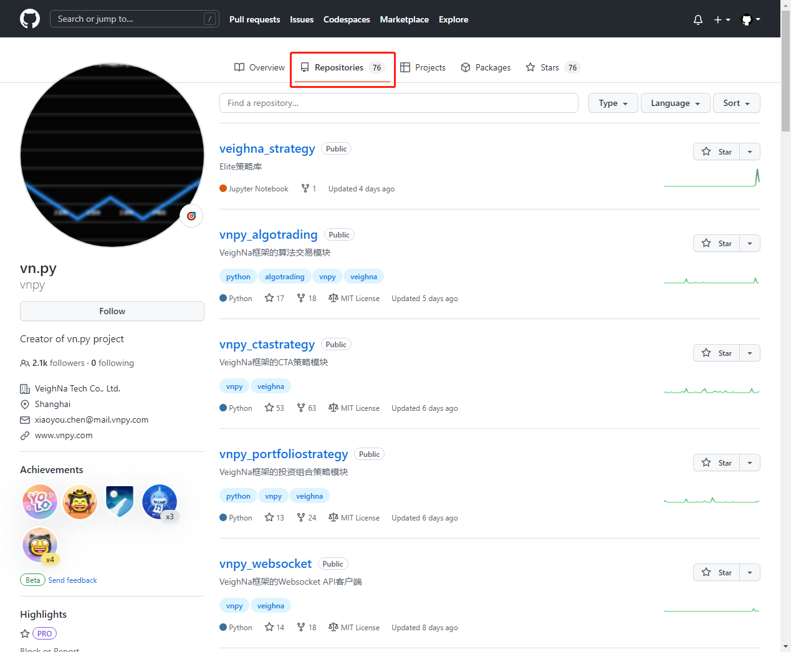

## 简介

实际名为vnpy的这个第三方库只包含很少的内容, 我们平时提到的vnpy是指整个vnpy系统, 包括vnpy核心部分以及其他扩展功能模块. 

## 安装vnpy

```python
pip install vnpy
```

## 安装功能模块

vn.py在github和gitee的仓库中目前有76个工具包(20221122), 可以根据需要有选择性的安装一些模块


```python
# 安装VeighNa框架的CTA策略模块
pip install vnpy_ctastrategy

# 安装VeighNa框架的数据管理模块
pip install vnpy_datamanager
...
```