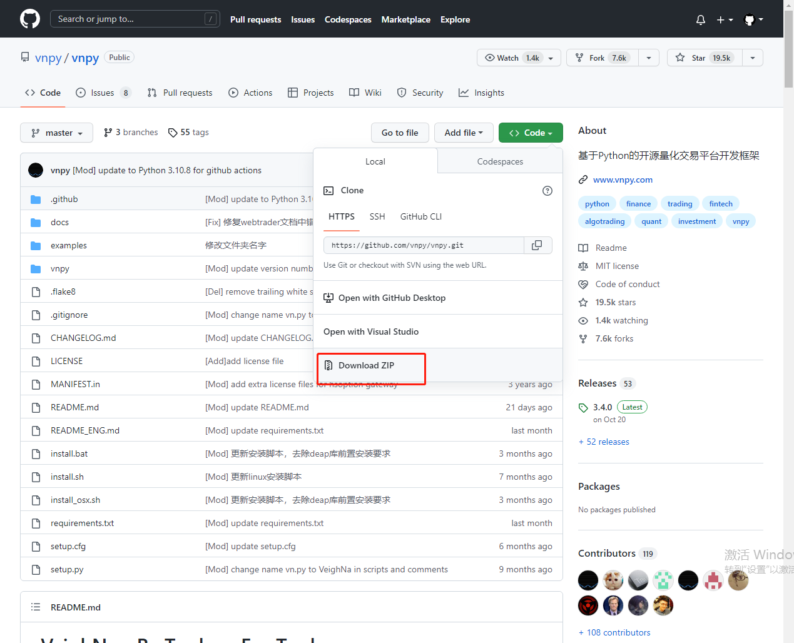

> [文档纠错/补充](https://github.com/dumengru/docs_vnpy/tree/master/docs/_docs)
---

## 下载文件
将github/gitee上的vnpy代码下载/克隆到本地

- [github地址](https://github.com/vnpy/vnpy)

- [gitee地址](https://gitee.com/vnpy/vnpy)



## 运行代码
1. 修改examples/veighna_trader/run.py文件, 该注释注释掉, 保留一下内容即可
```python
from vnpy.event import EventEngine
from vnpy.trader.engine import MainEngine
from vnpy.trader.ui import MainWindow, create_qapp
from vnpy_ctp import CtpGateway
from vnpy_ctastrategy import CtaStrategyApp
from vnpy_ctabacktester import CtaBacktesterApp
from vnpy_datamanager import DataManagerApp


def main():
    """"""
    # 1. 创建一个QT界面
    qapp = create_qapp()
    # 2. 创建事件引擎
    event_engine = EventEngine()
    # 3. 将事件引擎添加到主引擎, 并创建主引擎
    main_engine = MainEngine(event_engine)
    # 4. 添加交易网关
    main_engine.add_gateway(CtpGateway)
    # 5. 添加功能模块
    main_engine.add_app(CtaStrategyApp)
    main_engine.add_app(CtaBacktesterApp)
    main_engine.add_app(DataManagerApp)

    # 6. 将主引擎和事件引擎添加到QT窗口
    main_window = MainWindow(main_engine, event_engine)
    main_window.showMaximized()
    qapp.exec()

if __name__ == "__main__":
    main()
```
2. 首次执行以下代码, 会报很多错. 主要是缺少一些第三方库, 安装以下模块, 再次运行上述代码, 弹出VnTrader界面说明启动成功

```python
# pyqt相关模块
pip install qdarkstyle
pip install pyqtgraph
pip install PySide6==6.3.0     # 只能用该版本(6.4会报错)

# 遗传算法相关模块
pip install deap

# vnpy数据管理相关模块
pip install vnpy_sqlite
pip install vnpy_rqdata

# vnpy其他功能模块
pip install vnpy_ctp
pip install vnpy_ctastrategy
pip install vnpy_datamanager
pip install vnpy_ctabacktester
```

## 文件查看

1. anaconda/Lib/site-packages目录下(如果新建虚拟环境, 应该在envs\env_vnpy\Lib\site-packages目录)可以看到已安装的python第三方库(执行命令`pip list`也一样)
2. 在C盘用户目录下, 有一个.vntrader文件夹, 所有vnpy相关的数据都在这里