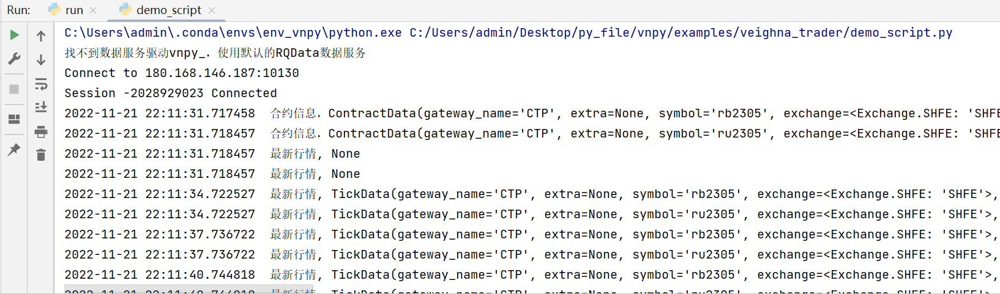

> [文档纠错/补充](https://github.com/dumengru/docs_vnpy/tree/master/docs/_docs)
---

## 简介

参考: [脚本策略交易模块](https://www.vnpy.com/docs/cn/script_trader.html)

## 安装模块
- `pip install vnpy_scripttrader`

## 启动代码

```python
from time import sleep
from vnpy_scripttrader import ScriptEngine
from vnpy.event import EventEngine
from vnpy.trader.engine import MainEngine
from vnpy_ctp import CtpGateway


def run(engine: ScriptEngine):
    """
    """
    vt_symbols = ["rb2305.SHFE", "ru2305.SHFE"]

    # 订阅行情
    engine.subscribe(vt_symbols)

    # 获取合约信息
    for vt_symbol in vt_symbols:
        contract = engine.get_contract(vt_symbol)
        msg = f"合约信息，{contract}"
        engine.write_log(msg)

    # 设置获取最新行情
    engine.strategy_active = True
    # 持续运行，使用strategy_active来判断是否要退出程序
    while engine.strategy_active:
        # 轮询获取行情
        for vt_symbol in vt_symbols:
            tick = engine.get_tick(vt_symbol)
            msg = f"最新行情, {tick}"
            engine.write_log(msg)

        # 等待3秒进入下一轮
        sleep(3)


def main():
    # 1. 创建主引擎
    # 2. 创建事件引擎
    event_engine = EventEngine()
    # 3. 将事件引擎添加到主引擎, 并创建主引擎
    main_engine = MainEngine(event_engine)
    # 4. 添加交易网关
    main_engine.add_gateway(CtpGateway)
    # 5. 连接网关(simnow用户名密码)
    setting = {
        "用户名": "",
        "密码": "",
        "经纪商代码": "9999",
        "交易服务器": "tcp://180.168.146.187:10130",
        "行情服务器": "tcp://180.168.146.187:10131",
        "产品名称": "",
        "授权编码": ""
    }
    # CTP引擎名称叫"CTP"(可通过源码查看)
    main_engine.connect(setting, "CTP")
    # 6. 创建脚本引擎
    script_engine = ScriptEngine(main_engine, event_engine)

    # 7. 启动
    run(script_engine)


if __name__ == '__main__':
    main()
```

## 踩坑记
1. simnow经常会崩
2. tts是simnow替代方案, 但偶尔会报4097错误(不要和ctp_gateway一起运行)

## 成功标志
