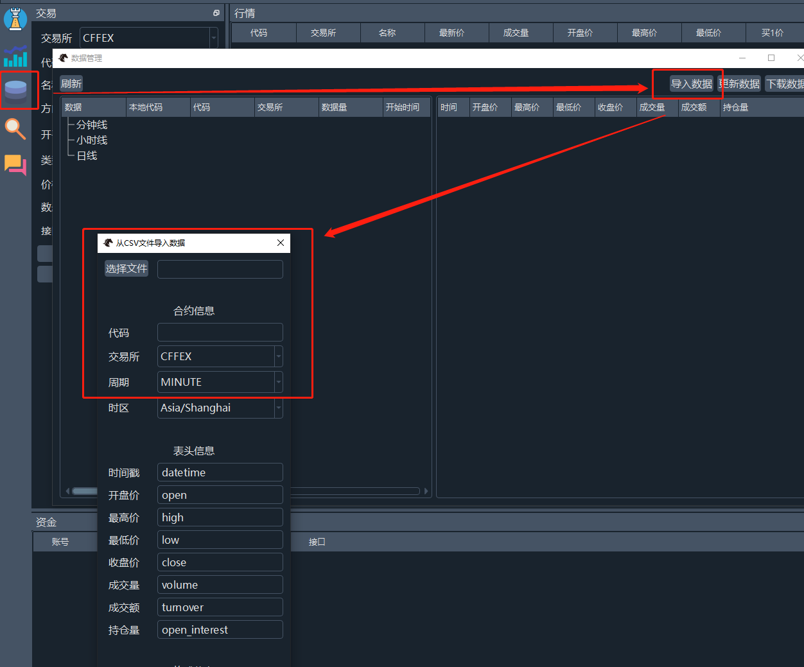
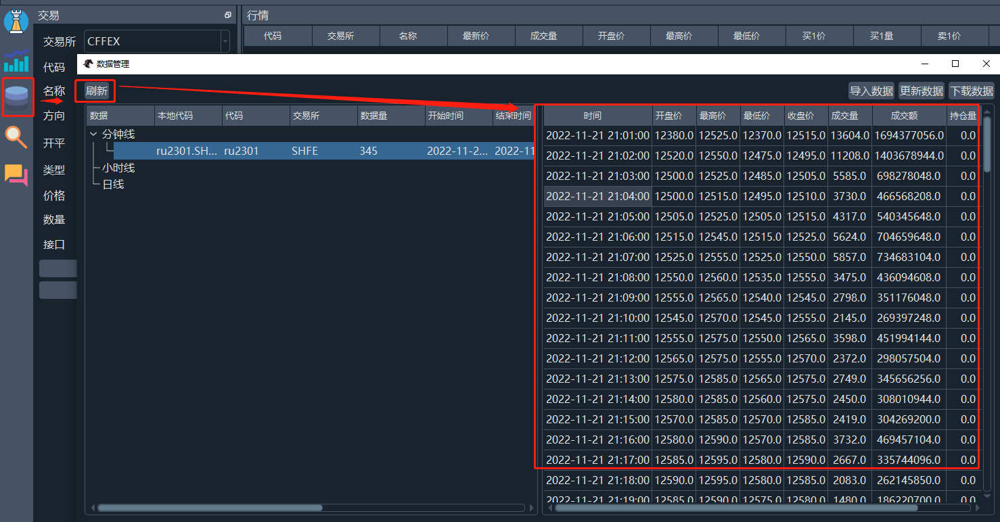
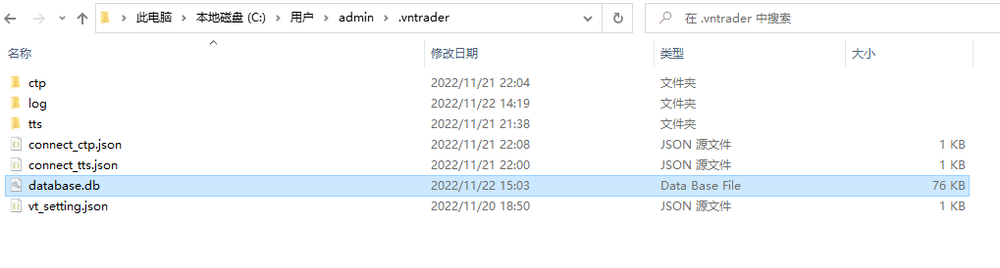

> [文档纠错/补充](https://github.com/dumengru/docs_vnpy/tree/master/docs/_docs)
---

## 简介
为了接下来的示例演示, 有必要准备点数据了

#### 下载数据
1. 安装开源库
```python
pip install efinance
```
2. 下载分钟数据使用示例
```python
import efinance as ef
# 获取全部期货行情ID列表
quote_ids = ef.futures.get_realtime_quotes().set_index("期货代码")['行情ID']
print(quote_ids)

# 获取第行情ID为第一个的期货日 K 线数据
kwargs = {
    "quote_ids": "113.ru2301",      # 行情id
    "beg": "20221101",
    # "end": "20221201",            # 不填
    "klt": "1",                     # 1标识分钟
}
df = ef.futures.get_quote_history(**kwargs)
print(df)
```

#### 保存数据
有两种方法
1. 将数据下载保存到本地, 然后通过图形界面上传数据(会写代码就不要这样搞)

2. 直接通过代码将数据下载, 格式转换, 数据入库搞定

> 在vnpy_datamanager中已经写好了数据保存入库的代码(实际就是图形界面的数据导入功能的源码), 我们唯一要做的就是按照vnpy的数据库格式下载保存csv文件数据

```python
import efinance as ef
# 获取全部期货行情ID列表
quote_ids = ef.futures.get_realtime_quotes().set_index("期货代码")['行情ID']

# 获取第行情ID为第一个的期货日 K 线数据
kwargs = {
    "quote_ids": "113.ru2301",      # 行情id
    "beg": "20221101",
    "end": "20221122",              # 不填默认下载到最新时间
    "klt": "5",                     # 5标识分钟, 1分钟只能下载最近1天的数据
}
df = ef.futures.get_quote_history(**kwargs)
# 数据保存到本地(一定要gbk格式)
df.to_csv("ru2301_1m.csv", index=False, encoding="gbk")
print(df.head())
print(df.shape)


from vnpy_datamanager import ManagerEngine
from vnpy.trader.engine import MainEngine, EventEngine
from vnpy.trader.constant import Interval, Exchange
import os

# 一定要写文件绝对路径
filename = os.path.abspath("ru2301_1m.csv")
# 构造一个数据库管理引擎
e = EventEngine()
m = MainEngine(e)
me = ManagerEngine(m, e)
# 导入csv数据到数据库
me.import_data_from_csv(
    file_path=filename,
    symbol="ru2301",
    exchange=Exchange.SHFE,
    interval=Interval.MINUTE,
    tz_name="Asia/Shanghai",
    datetime_head="日期",
    open_head="开盘",
    high_head="最高",
    low_head="最低",
    close_head="收盘",
    volume_head="成交量",
    turnover_head="成交额",
    open_interest_head="",
    datetime_format="",
)
```

## 成功标志

1. 通过图形界面查看数据

2. 数据保存位置: C盘用户目录.vntrader目录下的"database.db"


