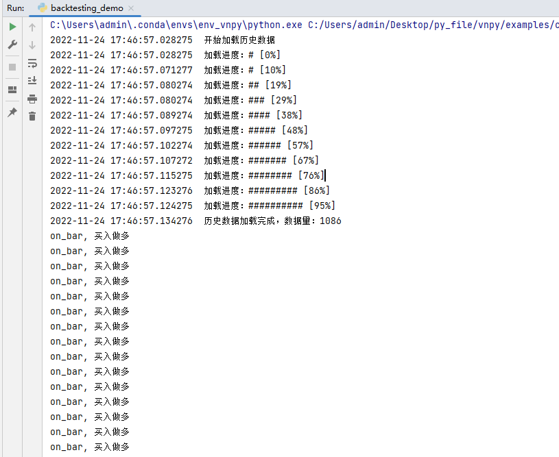

> [文档纠错/补充](https://github.com/dumengru/docs_vnpy/tree/master/docs/_docs)

---

## 简介
策略是量化交易的核心部分, 所有的量化交易策略都有自己的的编写规则, vnpy也一样

#### 编写规则
1. 策略文件可以存放在两个位置
- vnpy_ctastrategy/strategies
- 再用户目录下新建strategies文件夹, 然后存放在该文件夹下
2. CTA策略类要继承vnpy_ctastrategy/template.py下的`CtaTemplate`或者`TargetPosTemplate`(其实`TargetPosTemplate`也继承了`CtaTemplate`)
3. 在子类中实现`CtaTemplate`类用'@virtual'装饰器装饰的方法即可完成策略编写

#### 回调函数
- on_init: 策略初始化时执行
- on_start: 策略启动时执行
- on_stop: 策略停止时执行
- on_tick: 策略收到Tick执行
- on_bar: 出现新的K线时执行
- on_trade: 策略有成交时执行
- on_order: 策略发送订单时执行

#### 下单函数
- buy: 做多
- sell: 平多
- short: 做空
- cover: 平空
- cancel_order: 撤销订单
- cancel_all: 全部撤单

#### 辅助函数
- write_log: 输出日志
- get_pricetick: 获取品种最小变动价位

## 测试策略
```python
from vnpy_ctastrategy import (
    CtaTemplate,
    StopOrder,
    TickData,
    BarData,
    TradeData,
    OrderData
)


class NewStrategy(CtaTemplate):
    """"""
    def __init__(self, cta_engine, strategy_name, vt_symbol, setting):
        """"""
        super().__init__(cta_engine, strategy_name, vt_symbol, setting)

    def on_init(self):
        """
        Callback when strategy is inited.
        """
        # 加载1天的K线数据, 该函数一定要调用
        self.load_bar(1)
        self.write_log("策略初始化")

    def on_start(self):
        """
        Callback when strategy is started.
        """
        self.write_log("策略启动")

    def on_stop(self):
        """
        Callback when strategy is stopped.
        """
        self.write_log("策略停止")
    # 
    def on_tick(self, tick: TickData):
        """
        Callback of new tick data update.
        """
        print("on_tick")

    def on_bar(self, bar: BarData):
        """
        Callback of new bar data update.
        """
        self.cancel_all()

        
        print("on_bar, 买入做多")
        # 做多, 价格时上一个K线收盘价+3个最小变动价位
        self.buy(bar.close_price + 3*self.get_pricetick(), 1.0)

    def on_order(self, order: OrderData):
        """
        Callback of new order data update.
        """
        print("on_order",
              " datetime: ", order.datetime, 
              " price: ", order.price,
              " direction: ", order.direction)

    def on_trade(self, trade: TradeData):
        """
        Callback of new trade data update.
        """
        print("on_trade ", 
              " datetime: ", trade.datetime, 
              " price: ", trade.price,
              " direction: ", trade.direction)

```

## 成功标志
开始的on_bar输入的是预加载数据的K线回调

