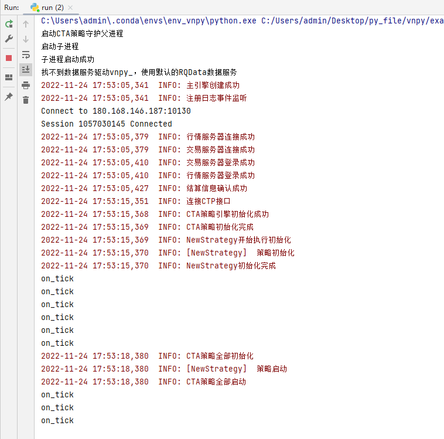

> [文档纠错/补充](https://github.com/dumengru/docs_vnpy/tree/master/docs/_docs)
---

## 简介
编写完策略之后就是将策略上线运行, vnpy给出的demo默认加载运行全部策略, 这里我略做修改, 只加载单个策略


## 无界面启动策略
```python
import multiprocessing
import sys
from time import sleep
from datetime import datetime, time
from logging import INFO

from vnpy.event import EventEngine
from vnpy.trader.setting import SETTINGS
from vnpy.trader.engine import MainEngine

from vnpy_ctp import CtpGateway
from vnpy_ctastrategy import CtaStrategyApp
from vnpy_ctastrategy.base import EVENT_CTA_LOG
from vnpy_ctastrategy.strategies.new_strategy import NewStrategy
from vnpy_ctastrategy.engine import CtaEngine

SETTINGS["log.active"] = True
SETTINGS["log.level"] = INFO
SETTINGS["log.console"] = True


ctp_setting = {
    "用户名": "",
    "密码": "",
    "经纪商代码": "9999",
    "交易服务器": "tcp://180.168.146.187:10130",
    "行情服务器": "tcp://180.168.146.187:10131",
    "产品名称": "",
    "授权编码": "",
    "产品信息": ""
}


# Chinese futures market trading period (day/night)
DAY_START = time(8, 45)
DAY_END = time(15, 0)

NIGHT_START = time(20, 45)
NIGHT_END = time(2, 45)


def check_trading_period():
    """ 检查交易时间 """
    current_time = datetime.now().time()
    trading = False
    if (
        (current_time >= DAY_START and current_time <= DAY_END)
        or (current_time >= NIGHT_START)
        or (current_time <= NIGHT_END)
    ):
        trading = True

    return trading


def run_child():
    """
    Running in the child process.
    """
    SETTINGS["log.file"] = True
    # 1. 创建事件引擎
    event_engine = EventEngine()
    # 2. 创建主引擎(自动初始化日志引擎)
    main_engine = MainEngine(event_engine)
    # 3. 添加CTA网关
    main_engine.add_gateway(CtpGateway)
    # 4. 添加app
    cta_engine: CtaEngine = main_engine.add_app(CtaStrategyApp)
    main_engine.write_log("主引擎创建成功")

    # 5. 获取日志引擎
    log_engine = main_engine.get_engine("log")
    # 5.1 将日志引擎注册到事件中
    event_engine.register(EVENT_CTA_LOG, log_engine.process_log_event)
    main_engine.write_log("注册日志事件监听")
    # 6. 连接CTP网关
    main_engine.connect(ctp_setting, "CTP")
    # 等待连接完成, 一定要等一会
    sleep(10)

    main_engine.write_log("连接CTP接口")
    # 7. 初始化网关
    cta_engine.init_engine()
    main_engine.write_log("CTA策略初始化完成")

    # 8. 初始化全部策略(首次启动会保存配置, 再次启动不用重复加载)
    if "NewStrategy" not in cta_engine.strategies.keys():
        cta_engine.add_strategy("NewStrategy", "NewStrategy", "ru2301.SHFE", {})
    cta_engine.init_strategy("NewStrategy")

    sleep(3)   # Leave enough time to complete strategy initialization
    main_engine.write_log("CTA策略全部初始化")
    # 9. 启动全部策略
    cta_engine.start_strategy("NewStrategy")
    main_engine.write_log("CTA策略全部启动")

    # 10. 如果不在交易时间, 关闭主引擎
    while True:
        sleep(3)
        trading = check_trading_period()
        trading = True      # 测试
        if not trading:
            print("关闭子进程")
            main_engine.close()
            sys.exit(0)


def run_parent():
    """
    Running in the parent process.
    """
    print("启动CTA策略守护父进程")
    child_process = None
    while True:
        # 1. 检查交易时间(测试, 暂时关掉)
        trading = True # check_trading_period()
        # 2. 交易时间启动子进程
        if trading and child_process is None:
            print("启动子进程")
            child_process = multiprocessing.Process(target=run_child)
            child_process.start()
            print("子进程启动成功")
        # 3. 非交易时间则退出子进程
        if not trading and child_process is not None:
            if not child_process.is_alive():
                child_process = None
                print("子进程关闭成功")

        sleep(5)


if __name__ == "__main__":
    run_parent()
```

## 踩坑记

1. 连接网关之后一定要多等会, 否则主引擎无法获取全部合约数据, 后面订阅品种也会失败
2. 添加单个策略时, 参数类名默认是策略类名字符串
3. 实际上整个程序不需要调用`NewStrategy`, 只需要个名字即可

## 成功标志
