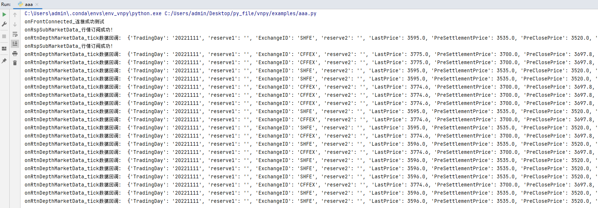

> [文档纠错/补充](https://github.com/dumengru/docs_vnpy/tree/master/docs/_docs)

---

## 简介
CTP网关就是连接CTP系统的接口, 上期技术只提供了C++版本的接口, vnpy使用的是自己封装的python版本接口.

CTP系统主要包括行情和交易两块内容, 分别对应两个文件"thostmduserapi_se.dll"和"thosttraderapi_se.dll", [openctp](https://github.com/krenx1983/openctp)项目之所以受欢迎, 是因为只需要将这两个文件更换为openctp提供的对应dll文件, 即可无缝衔接实盘和仿真交易

在"vnpy_ctp/ctp_gateway.py"文件中, `CtpMdApi`是用来处理行情的, `CtpTdApi`是用来处理交易的, 以"on..."开头的方法都是从交易所收到数据被动回调的方法, 不以"on..."开头的方法是本地客户端主动向交易所发起的请求.

## CtpMdApi
#### 请求方法
- connect: 连接服务器
- login: 用户登录
- subscribe: 订阅行情
- close: 关闭连接
#### 回调方法
- onFrontConnected: 服务器连接成功回报
- onFrontDisconnected: 服务器连接断开回报
- onRspUserLogin: 用户登录请求回报
- onRspError: 请求报错回报
- onRspSubMarketData: 订阅行情回报
- onRtnDepthMarketData: 行情数据推送

## CtpTdApi
#### 请求方法
- connect: 连接服务器
- authenticate: 发起授权验证
- login: 用户登录
- send_order: 委托下单
- cancel_order: 委托撤单
- query_account: 查询资金
- query_position: 查询持仓
- close: 关闭连接

#### 回调方法
- onFrontConnected: 服务器连接成功回报
- onFrontDisconnected: 服务器连接断开回报
- onRspAuthenticate: 用户授权验证回报
- onRspUserLogin: 用户登录请求回报
- onRspOrderInsert: 委托下单失败回报
- onRspOrderAction: 委托撤单失败回报
- onRspSettlementInfoConfirm: 确认结算单回报
- onRspQryInvestorPosition: 持仓查询回报
- onRspQryTradingAccount: 资金查询回报
- onRspQryInstrument: 合约查询回报
- onRtnOrder: 委托更新推送
- onRtnTrade: 成交数据推送

## CtpGateway
1. 初始化
- self.td_api: 交易接口
- self.md_api: 行情接口
2. connect: 同时连接交易和行情接口
3. subscribe: 通过行情接口订阅行情
4. send_order: 通过交易接口发送订单
5. cancel_order: 通过交易接口撤单
6. query_account: 通过交易接口查询账户
7. query_position: 通过交易接口查询持仓
8. close: 关闭交易和行情接口

## 网关测试
这里使用"tts_gateway"做测试(和"ctp_gateway"完全一致)

1. 首先在"vnpy_tts/gateway/tts_gateway.py"文件中的`TtsMdApi`类中添加三个`print`标记
```pyhton
def onFrontConnected(self) -> None:
    """服务器连接成功回报"""
    print("onFrontConnected_连接成功测试")

def onRspSubMarketData(self, data: dict, error: dict, reqid: int, last: bool) -> None:
    """订阅行情回报"""
    print("onRspSubMarketData_行情订阅成功!")

def onRtnDepthMarketData(self, data: dict) -> None:
    """行情数据推送"""
    # 过滤没有时间戳的异常行情数据
    if not data["UpdateTime"]:
        return
    symbol: str = data["InstrumentID"]
    print("onRtnDepthMarketData_tick数据回调: ", data)
```
2. 然后执行以下代码
```python
import time
from vnpy_tts.gateway.tts_gateway import TtsMdApi, TtsGateway
from vnpy.trader.engine import EventEngine
from vnpy.trader.object import SubscribeRequest
from vnpy.trader.constant import Exchange


if __name__ == '__main__':
    # 使用tts用户名和密码
    setting = {
        "address": "tcp://121.37.80.177:20004",
        "userid": "",
        "password": "",
        "brokerid": "",
    }

    tts = TtsGateway(EventEngine(), "tts")
    md = TtsMdApi(tts)
    # 1. 查看是否有连接成功后的回调
    md.connect(**setting)
    # 2. 查看是否有订阅成功后的回调
    md.subscribe(SubscribeRequest("rb2303", Exchange.SHFE))
    md.subscribe(SubscribeRequest("IF2303", Exchange.CFFEX))
    # 等待一下, 否则主进程直接结束了
    time.sleep(3)
```

#### 成功记录
